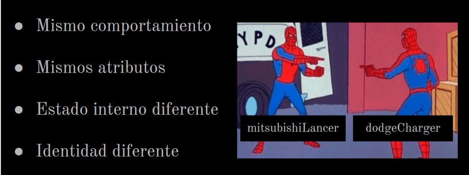

# Rápidos y furiosos

## Ejemplo de Clases e instanciación

Cosas en común en las que nos centraremos: 
* Características: color - potencia de motor - velocidad - tanque de nitro
* Comportamiento: arrancar - acelerar - desacelerar - usar nitrógeno - apagar

**Estado interno de un objeto depende del valor de sus atributos en un momento determinado.
Si tengo objetos parecidos que tienen los mismos atributos, cada objeto puede tener distintos valores en dichos atributos, por lo cual cada uno tiene diferentes estados internos.**

Solución con conceptos previos: con objetos autodefinidos y lógica repetida: coches.wlk

Nueva solución: con objetos como instancias de Clases: clase_coche.wlk

[Video de la clase](https://youtu.be/ClfJ_fNxj_s)
[Presentacion](https://drive.google.com/file/d/1ZGWEYsNkcgnvl-jqtjlz-pAsTQIV8kH9/view?usp=sharing)

